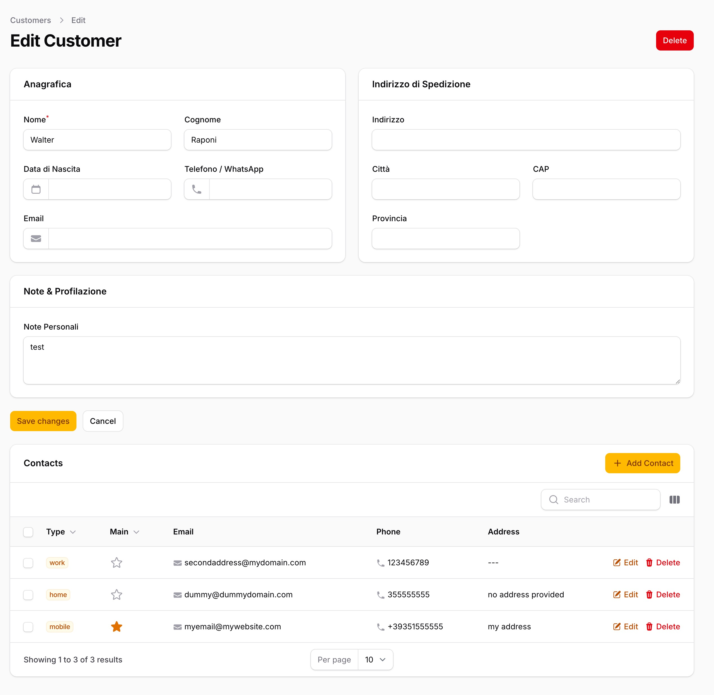

# Filament Contacts

[](https://packagist.org/packages/wraps/filament-contacts)
[](https://packagist.org/packages/wraps/filament-contacts)
[](https://packagist.org/packages/wraps/filament-contacts)

**Filament Contacts** is a powerful and flexible plugin for FilamentPHP v3/v4 that adds a polymorphic relationship manager to handle multiple contacts (emails, phone numbers, addresses) for any Eloquent model.

It features a built-in "Primary Contact" logic, customizable options, and a clean UI fully integrated with Filament.




## Features

- **Polymorphic Relationship**: Attach contacts to Users, Clients, Suppliers, or any other model.
- **Primary Contact Logic**: Automatically handles the `is_primary` flag (toggling one sets others to false).
-  **Fully Customizable**: Control visibility of fields, icons, and modal behavior via a fluent API.
- **Soft Deletes**: Built-in support for soft deletes to safely manage data.
- **Localization**: Available in English and Italian.

## Installation

You can install the package via composer:

```bash
composer require wraps/filament-contacts
```

Publish and run the migrations:

```bash
php artisan filament-contacts:install
```

migrations and `config/filament-contacts.php` will be published.

>If the table name "contacts" does not suits your project PLEASE update the config file before migrate

## Usage

**1. Add the Trait to your Model**
Add the `HasContacts` trait to any model where you want to attach contacts.


```php
namespace App\Models;

use Illuminate\Database\Eloquent\Model;
use Wraps\FilamentContacts\Traits\HasContacts;

class Customer extends Model
{
    use HasContacts;
}
```

**2. Register the Relation Manager**

Add the `ContactsRelationManager` to your Filament Resource `getRelations()` method.

```php
namespace App\Filament\Resources;

use App\Filament\Resources\CustomerResource\Pages;
use App\Models\Customer;
use Filament\Resources\Resource;
use Wraps\FilamentContacts\Filament\Resources\RelationManagers\ContactsRelationManager;

class CustomerResource extends Resource
{
    public static function getRelations(): array
    {
        return [
            ContactsRelationManager::class,
        ];
    }
}
```

That's it! You now have a fully functional contacts manager tab in your resource.

## Configuration & Customization

You can customize the behavior of the relation manager by overriding the `getFilamentContactOptions()` method in your Model.

**Available Options**


The `ContactOptions` class provides a fluent API to configure the UI:

* `searchable(bool)`: Toggle search visibility.

* `readonly(bool)`: Disable create/edit/delete actions.

* `slideOver(bool)`: Use a slide-over modal instead of a standard modal.

* `hide(array)`: Hide specific fields (email, phone, address).

* `icons(array)`: Override default icons.


**Example: Customizing the implementation**

In your Model (e.g., `Customer.php`):

```php
use Wraps\FilamentContacts\Support\ContactOptions;
use Wraps\FilamentContacts\Support\ContactColumn;

public function getFilamentContactOptions(): ContactOptions
{
    return ContactOptions::make()
        ->searchable(true)     // Enable search
        ->slideOver(true)      // Open forms in a slide-over
        ->hide([               // Hide specific columns if not needed
            ContactColumn::ADDRESS 
        ]) 
        ->icons([              // Custom icons
            'create' => 'heroicon-m-user-plus',
        ]);
}
```

**Retrieving the Primary Contact**

Since the plugin handles the is_primary logic automatically, you can easily retrieve the main contact for a model:

```php
TextColumn::make('primaryContact.email')
    ->label('Email')
    ->icon('heroicon-m-envelope')
    ->copyable()
    ->searchable(),
```


**Translations**

This package is currently translated into:

* English
* Italian

To publish translations:

```bash
php artisan vendor:publish --tag="filament-contacts-translations"
```

